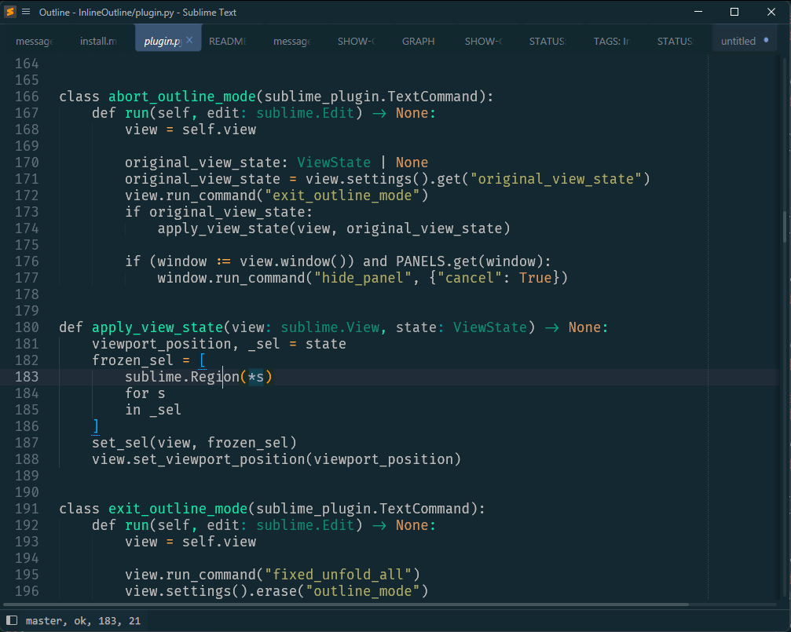
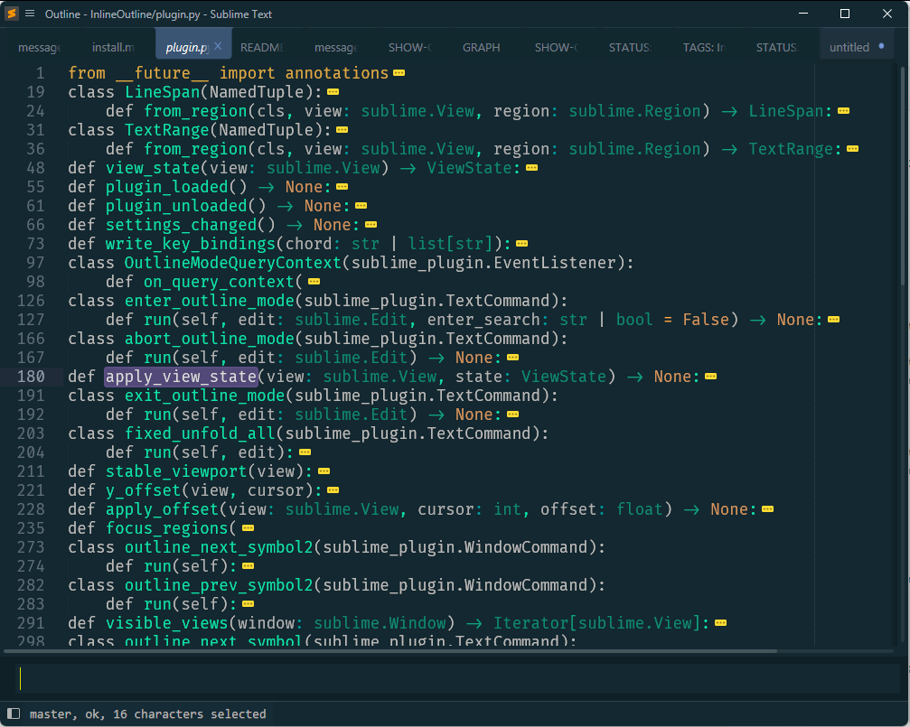
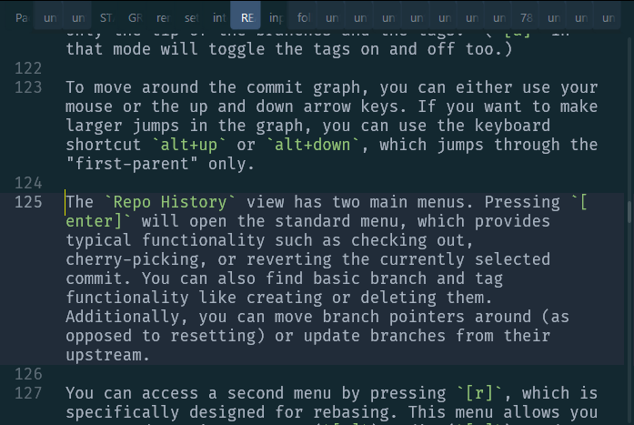
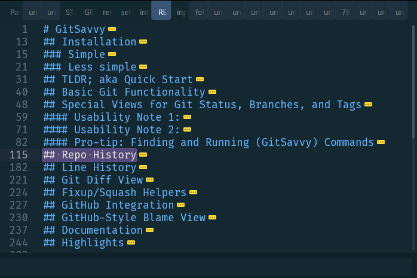

## Hi 👋🏾

This is a plugin for Sublime Text.  It is a temporary Outline-mode.

| Normal Mode                | InlineOutline Mode          |
|----------------------------|-----------------------------|
|  |  |
|    |    |

At the same time, it is also a complete replacement but different approach to *Goto Symbol*.
For example, you can fuzzy-search:

https://github.com/kaste/InlineOutline/assets/8558/42a8a375-2bae-4385-b0df-8580d6c83f69

Or walk using the arrow keys (or `,`and `.`):

https://github.com/kaste/InlineOutline/assets/8558/d6eca69b-c9b9-46b3-9b66-e61dd6303b47

As usual, `<enter>` will go to to the selected symbol and `<esc>` will reset the
cursor and viewport.


# Key binding

By default, the plugin binds `primary+shift+o` (`primary` is `ctrl`), `o` as in
outline.  You can change that in the settings (`Preferences: InlineOutline Settings`).
That's also where you can disable all key bindings; just read the instructions over there.

The main command to enter the outline mode accepts an initial search term. For example:

```json
{
    "keys": ["primary+shift+o"],
    "command": "enter_outline_mode",
    "args": { "enter_search": "class " }
}
```

would let you see all defined *classes* in a Python file.  If you find that
useful, either as a key binding or as a command for the Command Palette or
context menu, you need to add that manually in the right places inside your
User package -- *as usual*.
